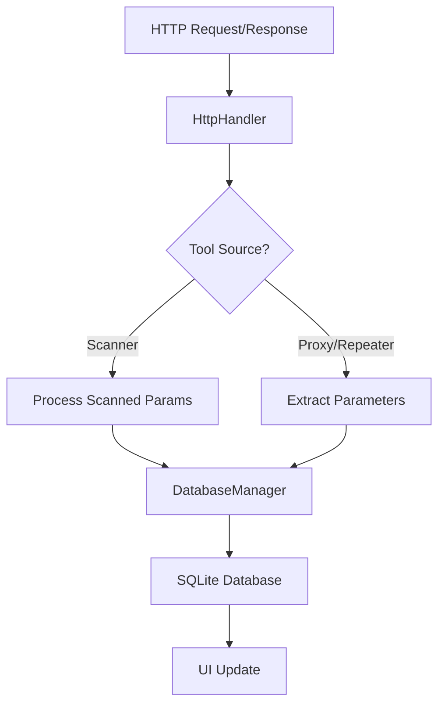

# Recheck Scan API Extension

[]()
[]()
[]()

## 📋 Mô tả

**Recheck Scan API Extension** là một extension dành cho Burp Suite Professional giúp theo dõi và quản lý trạng thái quét các API endpoints. Extension này tự động phát hiện, lưu trữ và theo dõi các tham số của API, đồng thời cung cấp giao diện trực quan để quản lý trạng thái quét.

## ✨ Tính năng chính

### 🔍 Phát hiện API tự động
- Tự động phát hiện và ghi nhận các API endpoints từ HTTP traffic
- Trích xuất tham số từ URL query string và request body
- Hỗ trợ các định dạng: JSON, XML, URL-encoded, Multipart

### 📊 Quản lý trạng thái
- **Scanned**: Tham số đã được Burp Scanner quét
- **Rejected**: API bị từ chối không quét (do người dùng đánh dấu)
- **Bypassed**: API được tự động bỏ qua (không có tham số)
- **Repeater**: API đã được gửi qua Burp Repeater

### 🎯 Lọc và tìm kiếm thông minh
- Tab **Unscanned**: Chỉ hiển thị API chưa được xử lý
- Tab **Logs**: Hiển thị tất cả API đã ghi nhận
- Tìm kiếm real-time theo đường dẫn API
- Sắp xếp và lọc theo nhiều tiêu chí

### 🔧 Cài đặt linh hoạt
- Loại trừ file extension không cần thiết
- Loại trừ status code cụ thể
- Tự động highlight/note trong Proxy history
- Tự động bypass API không có tham số

## 🚀 Cài đặt

### Yêu cầu hệ thống
- Burp Suite Professional 2023.1.2+
- Java Runtime Environment 17+
- SQLite JDBC Driver (đã tích hợp)

### Hướng dẫn cài đặt

1. **Build project**:
   ```bash
   # Clone repository
   git clone https://github.com/vn-ncvinh/RecheckScan.git
   cd RecheckScan
   
   # Build với Maven
   mvn clean package
   ```

2. **Load extension vào Burp**:
   - Mở Burp Suite Professional
   - Vào tab `Extensions` → `Installed`
   - Click `Add` → `Java`
   - Chọn file `target/RecheckScan-1.0.jar`

3. **Xác nhận cài đặt**:
   - Tab mới "Recheck Scan" sẽ xuất hiện
   - Kiểm tra log output trong Extensions

## 📖 Hướng dẫn sử dụng

### Cấu hình ban đầu

1. **Vào tab Settings**:
   - Cấu hình đường dẫn lưu database
   - Thiết lập file extensions cần loại trừ
   - Bật/tắt các tính năng highlight và note

2. **Áp dụng cài đặt**:
   - Click nút `Apply` để lưu cấu hình
   - Database sẽ được tạo/tải lại tự động

### Quy trình làm việc

1. **Thu thập API**: 
   - Browse target application
   - APIs sẽ tự động được ghi nhận

2. **Quản lý trạng thái**:
   - Vào tab `Unscanned` xem APIs chưa quét
   - Send to Scanner hoặc đánh dấu Rejected
   - Theo dõi tiến độ trong Statistics

3. **Theo dõi kết quả**:
   - Tab `Logs` hiển thị tổng quan
   - Sử dụng search để tìm API cụ thể
   - Copy đường dẫn với Ctrl+C

## 🏗️ Kiến trúc hệ thống

```
RecheckScanApiExtension
├── DatabaseManager     # Quản lý SQLite database
├── SettingsPanel      # Giao diện cài đặt
└── HttpHandler        # Xử lý HTTP traffic
```

### Luồng dữ liệu



### Cấu trúc Database

```sql
CREATE TABLE api_log (
    id INTEGER PRIMARY KEY AUTOINCREMENT,
    method TEXT NOT NULL,
    host TEXT NOT NULL,
    path TEXT NOT NULL,
    unscanned_params TEXT,           -- Tham số chưa quét
    scanned_params TEXT,             -- Tham số đã quét
    is_scanned BOOLEAN DEFAULT 0,    -- Đã quét xong
    is_rejected BOOLEAN DEFAULT 0,   -- Bị từ chối
    is_bypassed BOOLEAN DEFAULT 0,   -- Tự động bypass
    is_from_repeater BOOLEAN DEFAULT 0, -- Từ Repeater
    last_seen TIMESTAMP DEFAULT CURRENT_TIMESTAMP,
    UNIQUE(host, path, method)
);
```

## ⚙️ Cấu hình nâng cao

### File cấu hình
Được lưu tại: `%USERPROFILE%\AppData\Local\RecheckScan\scan_api.txt`

```
.js,.svg,.css,.png,.jpg,.ttf,.ico,.html,.map,.gif,.woff2,.bcmap,.jpeg,.woff
false
false
C:\Path\To\Database\scan_api.db
true
404,405
```

### Tùy chỉnh Extensions loại trừ
```
# Các file static thường loại trừ
.js, .css, .png, .jpg, .gif, .ico
.svg, .ttf, .woff, .woff2
.html, .map, .bcmap
```

### Auto-bypass Rules
- Chỉ áp dụng cho API method GET
- Chỉ bypass khi không có tham số nào
- Không override API đã được scan/reject

## 🔧 Development

### Cấu trúc project

```
src/main/java/com/example/
├── DatabaseManager.java          # Core database operations
├── RecheckScanApiExtension.java   # Main extension class
└── SettingsPanel.java            # UI settings panel
```

### Build và Test

```bash
# Compile
mvn clean compile

# Run tests  
mvn test

# Package
mvn package

# Install dependencies
mvn dependency:resolve
```

### Logging và Debug

Extension sử dụng Montoya API logging:
- Output: Thông tin hoạt động bình thường
- Errors: Lỗi và exceptions
- Enable trong Extensions → Output

## 🐛 Troubleshooting

### Lỗi thường gặp

1. **Database connection failed**:
   - Check quyền ghi thư mục
   - Verify đường dẫn database path

2. **UI không cập nhật**:
   - Check Extension output log
   - Restart Burp Suite

3. **Không detect API**:
   - Verify target trong Scope
   - Check excluded extensions
   - Kiểm tra status code filters

### Performance Issues

- **Large database**: Sử dụng pagination
- **Memory usage**: Giới hạn table rows hiển thị
- **Slow scanning**: Check excluded patterns

## 📝 Changelog

### Version 2.0
- ✅ Migration từ CSV sang SQLite
- ✅ Thêm auto-bypass functionality
- ✅ Cải thiện UI với tabs riêng biệt
- ✅ Thread-safe database operations
- ✅ Better error handling

### Version 1.0
- ✅ Basic API detection
- ✅ CSV export functionality
- ✅ Manual status management

## 🤝 Đóng góp

1. Fork project
2. Tạo feature branch (`git checkout -b feature/AmazingFeature`)
3. Commit changes (`git commit -m 'Add some AmazingFeature'`)
4. Push to branch (`git push origin feature/AmazingFeature`)
5. Tạo Pull Request

## 📄 License

Project này được phân phối dưới MIT License. Xem `LICENSE` file để biết thêm chi tiết.

## 👥 Credits

- Phát triển bởi [vn-ncvinh](https://github.com/vn-ncvinh)
- Sử dụng [Montoya API](https://portswigger.net/burp/documentation/desktop/extensions/montoya-api)
- Database: SQLite với JDBC driver

## 📞 Liên hệ

- GitHub Issues: [Create Issue](https://github.com/vn-ncvinh/RecheckScan/issues)
- Email: [Contact](mailto:your-email@domain.com)

---

⭐ **Star project này nếu nó hữu ích cho bạn!**
